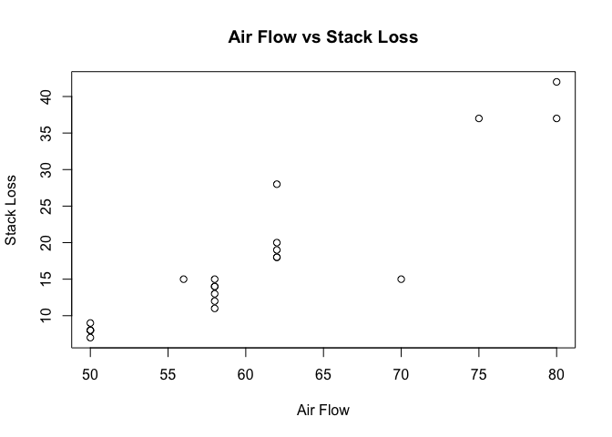

#Introduction
This R Markdown Document provides the ScatterPlot graphic of the relationship between the Air Flow and Stack Loss weather patterns from the data set stackloss (already provided and loaded in R).

#Specifications
Given that the dataset stackloss is already available in R, we will simply use this data set to understand the summary of the data, the layout of the data, as well as the Scatter Plot graphical to dispaly the data.


```r
#Retrieve the summary of the stackloss dataset
summary(stackloss)
```

```
##     Air.Flow       Water.Temp     Acid.Conc.      stack.loss   
##  Min.   :50.00   Min.   :17.0   Min.   :72.00   Min.   : 7.00  
##  1st Qu.:56.00   1st Qu.:18.0   1st Qu.:82.00   1st Qu.:11.00  
##  Median :58.00   Median :20.0   Median :87.00   Median :15.00  
##  Mean   :60.43   Mean   :21.1   Mean   :86.29   Mean   :17.52  
##  3rd Qu.:62.00   3rd Qu.:24.0   3rd Qu.:89.00   3rd Qu.:19.00  
##  Max.   :80.00   Max.   :27.0   Max.   :93.00   Max.   :42.00
```

```r
#Retrieve the structure of the stackloss dataset
str(stackloss)
```

```
## 'data.frame':	21 obs. of  4 variables:
##  $ Air.Flow  : num  80 80 75 62 62 62 62 62 58 58 ...
##  $ Water.Temp: num  27 27 25 24 22 23 24 24 23 18 ...
##  $ Acid.Conc.: num  89 88 90 87 87 87 93 93 87 80 ...
##  $ stack.loss: num  42 37 37 28 18 18 19 20 15 14 ...
```

```r
#Assign the data from stackloss to the scatter plot data and verify the data
input <- stackloss[,c("Air.Flow","stack.loss")]
print(head(input))
```

```
##   Air.Flow stack.loss
## 1       80         42
## 2       80         37
## 3       75         37
## 4       62         28
## 5       62         18
## 6       62         18
```

```r
# Plot the chart using the 2 variables Air Flow and Stack Loss
plot(x = input$"Air.Flow",y = input$"stack.loss",
     xlab = "Air Flow",
     ylab = "Stack Loss",
     main = "Air Flow vs Stack Loss"
)
```

<!-- -->
