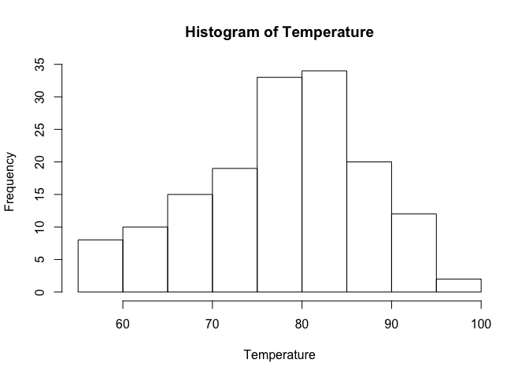
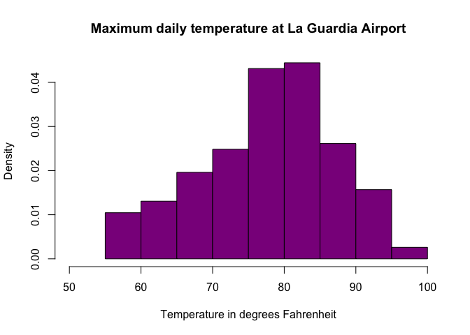
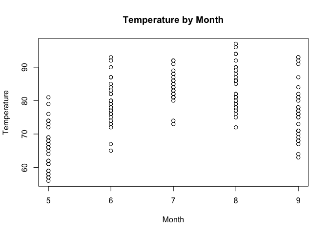
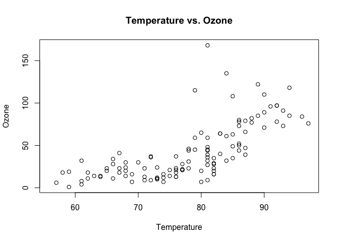
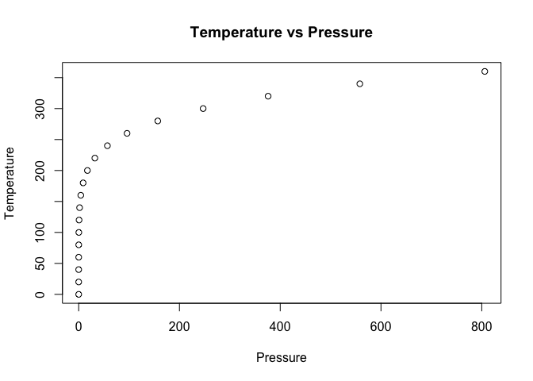
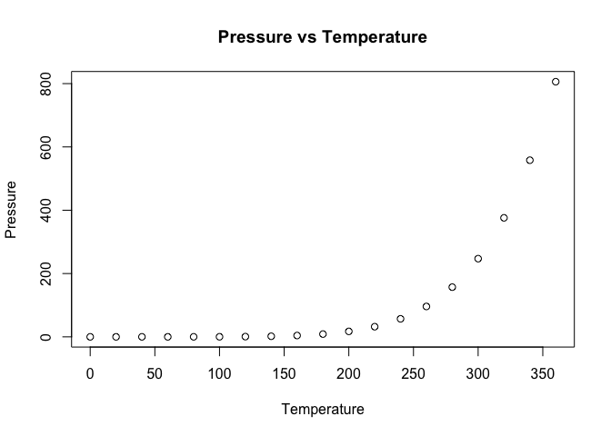

## What is a basic workflow for reproducible research?
The basic workflow for a reproducible project should follow 3 steps:

* Data Gathering
* Data Analysis
* Data Presentation

## What are 5 practical tips for making research reproducible?
While following the workflow steps above, there are 5 practical ways that help make your research reproducible:

* Document everything!
* Store everything as a (text) file
* All files should be human readable
* Explicitly tie your files together
* Have a plan to organize, store, and make your files available

## Give an example of how you might implement each tip.
There are practical tools available to help as you go through the 5 practical steps for making research reproducible Listed below are examples at each tip:

* Documenting Everything: Recording your R session will help others identify packages and versions of your sessions

* Storing everything as a text file helps to ensure as technology changes, the file format does not. The TXT format has been around unchanged for 20 years and we hope it remains 20 more years. Using XLS or DOC files are subject to the changes in the software over the years

* All files being human readable ensures that people who will work on your project in the future can read and understand them. Using comments in your code is one way to make your computer readable files; human readable.

* Explicitly tie your files together. This will ensure it is clear where your data or information came from in a presentation document. People need to see the modular relationship of the files used in the output, but shouldn't have to search for where the content originated. 
* From the beginning, we want to think about how to organize the files so independent people can reproduce the work. This can be done by limiting the content of any one file and ensuring all of the files are available on DropBox or GitHub.


## Which one of these do you think will be the most difficult?

Given that most of us are used to using tools like folder structures and text files; documenting everything will be the hardest part for me. Given that doing the study / research is lead bearing in itself, you sometimes become distracted or take for granted "how" you went about getting the results. Constantly bearing in mind that someone else needs to do this with ease will be difficult. In fact I think documentation on ANY project is the hardest.

## Air History Scatter Plot

This assignment was to take current data and complete code to make the plot of the graphs fit certain specifications


```r
# We will be using the built-in dataset airquality which has daily air quality 
# measurements in New York from May to September 1973
str(airquality)
```

```
## 'data.frame':	153 obs. of  6 variables:
##  $ Ozone  : int  41 36 12 18 NA 28 23 19 8 NA ...
##  $ Solar.R: int  190 118 149 313 NA NA 299 99 19 194 ...
##  $ Wind   : num  7.4 8 12.6 11.5 14.3 14.9 8.6 13.8 20.1 8.6 ...
##  $ Temp   : int  67 72 74 62 56 66 65 59 61 69 ...
##  $ Month  : int  5 5 5 5 5 5 5 5 5 5 ...
##  $ Day    : int  1 2 3 4 5 6 7 8 9 10 ...
```

```r
# Take only Temp columns
Temperature <- airquality$Temp
hist(Temperature)
```

<!-- -->

```r
# Histogram with added parameters
hist(Temperature,
     main="Maximum daily temperature at La Guardia Airport",
     xlab="Temperature in degrees Fahrenheit",
     xlim=c(50,100),
     col="darkmagenta",
     freq=FALSE
)
```

<!-- -->

```r
# TODO: Assignment 2, Q2A: Complete the following code to yield a scatterplot with x as Month and y as Temp
# You're going to customize your plot slightly.  Use the help function to assist you if needed.
# Make the x label "Month" and the y label "Temperature"
# Finally, make the title of the plot "Temperature by Month" 
plot(x=airquality$Month, y=airquality$Temp,
     xlab = "Month",
     ylab = "Temperature", 
     main = "Temperature by Month"
)
```

<!-- -->

```r
# TODO: Assignment 2, Q2B: Build a scatter plot with x as Temperature and y as Ozone 
# Complete the following code:
# Make the x label "Temperature" and the y label "Ozone",
# Make the title of the plot "Temperature vs Ozone"
plot(x=airquality$Temp, y=airquality$Ozone,
     xlab = "Temperature",
     ylab = "Ozone", 
     main = "Temperature vs. Ozone"
)
```

<!-- -->

## R Markdown

This is an R Markdown document. Markdown is a simple formatting syntax for authoring HTML, PDF, and MS Word documents. For more details on using R Markdown see <http://rmarkdown.rstudio.com>.

When you click the **Knit** button a document will be generated that includes both content as well as the output of any embedded R code chunks within the document. You can embed an R code chunk like this:


```r
summary(cars)
```

```
##      speed           dist       
##  Min.   : 4.0   Min.   :  2.00  
##  1st Qu.:12.0   1st Qu.: 26.00  
##  Median :15.0   Median : 36.00  
##  Mean   :15.4   Mean   : 42.98  
##  3rd Qu.:19.0   3rd Qu.: 56.00  
##  Max.   :25.0   Max.   :120.00
```

<!-- -->

## Including Plots

```r
summary(pressure)
```

```
##   temperature     pressure       
##  Min.   :  0   Min.   :  0.0002  
##  1st Qu.: 90   1st Qu.:  0.1800  
##  Median :180   Median :  8.8000  
##  Mean   :180   Mean   :124.3367  
##  3rd Qu.:270   3rd Qu.:126.5000  
##  Max.   :360   Max.   :806.0000
```

You can also embed plots as default, for example:
<!--
TODO: Assignment 2: 3A, complete the following scatter plot. 
The x axis is pressure, while the y axis is temperature
Please title the graph "Temperature vs Pressure"
-->
<!-- -->

Now flip it!

<!--
TODO: Assignment 2: 3B, complete the following scatter plot:
x axis is pressure, y axis is temperature,
Label the x axis as "Pressure" and the y axis as "Temperature", 
Title the graph as "Pressure vs Temperature"
-->

<!-- -->

