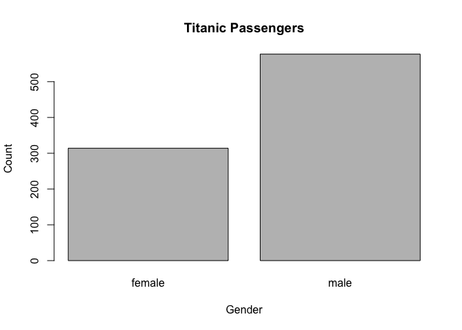

## Assignment 03
This assignment was focused on GIT commands for cloning, data summary exercises, and finally assembling a repeatble function for reading in a data set as well as producing a report.

### GitHub Cloning (20 points)
Using Git, clone the following GitHub repository to your local machine: https://github.com/caesar0301/awesome-public-datasets.


```r
# Last login: Mon May 28 12:15:20 on console
# MacBook-Pro-15:~ ldacy$ cd /Users/ldacy/Dropbox/Education/MSDS/6306/Units/04 
# MacBook-Pro-15:04 ldacy$ mkdir PDS
# MacBook-Pro-15:04 ldacy$ cd PDS
# MacBook-Pro-15:PDS ldacy$ git clone https://github.com/caesar0301/awesome-public-datasets
# # Cloning into 'awesome-public-datasets'...
# remote: Counting objects: 1475, done.
# remote: Total 1475 (delta 0), reused 0 (delta 0), pack-reused 1475
# Receiving objects: 100% (1475/1475), 561.47 KiB | 206.00 KiB/s, done.
# Resolving deltas: 100% (860/860), done.
# MacBook-Pro-15:PDS ldacy$  
```

### Data Summary (20 points)
From this aforementioned cloned repo, extract titanic.csv.zip. In R, read in titanic.csv via either read.table() or read.csv(), assigning it to df.


```r
unzip("PDS/awesome-public-datasets/Datasets/titanic.csv.zip")
df <- read.csv("titanic.csv")
```

Output the respective count of females and males aboard the Titanic. Plot the frequency of females and males.


```r
plot(x = df$Sex,
     xlab = "Gender",
     ylab = "Count",
     main = "Titanic Passengers"
)
```

<!-- -->

Use one apply function to output the means of Age, Fare, and Survival. Make sure the output is a real number for all three means.


```r
tapply(df$Age, df$Sex, mean, na.rm=TRUE)
```

```
##   female     male 
## 27.91571 30.72664
```

```r
tapply(df$Fare, df$Sex, mean, na.rm=TRUE) 
```

```
##   female     male 
## 44.47982 25.52389
```

```r
tapply(df$Survived, df$Sex, mean, na.rm=TRUE) 
```

```
##    female      male 
## 0.7420382 0.1889081
```

### Function Building (30 points)
You research sleep and just got your first data set.  Later, you’ll have another dataset with the same column names, so you want to create a helper function that you can analyze this dataset and the next.


```r
SleepDataFunction <- function(sleepDataURL="http://talklab.psy.gla.ac.uk/L1_labs/lab_1/homework/sleep_data_01.csv", RoundBy = 2) {
  
  library(repmis) #load the rempis library to handle the downloaded data
  sleepData <- source_data(sleepDataURL, sep = ",", header = TRUE) #store the data
  
  # Create the objects that will hold the data manipulation requested
  medianAge <- median(sleepData$Age, na.rm=TRUE)
  rangeDuration <- (max(sleepData$Duration, na.rm=TRUE) - min(sleepData$Duration, na.rm=TRUE))
  meanRSES <- mean(sleepData$RSES, na.rm=TRUE)
  sdRSES <- sd(sleepData$RSES, na.rm=TRUE)
 
  # Create a data.frame object called report and round to default or accepted change of decimal places passing in the RoundBy parameter which is defaulted to 2.
  report <- data.frame(round(medianAge, digits = RoundBy), 
                       round((meanRSES/5), digits = RoundBy), 
                       round((sdRSES/5), digits = RoundBy), 
                       round(rangeDuration, digits = RoundBy))
  
  # Update the data.frame column names to remain consistent
  colnames(report) <- c("MedianAge", "SelfEsteem", "SE_SD", "DurationRange")
  
  # Output the report
  report
}
```

Finally, run the function on your sleep data to show the output.


```r
SleepDataFunction()
```

```
## Downloading data from: http://talklab.psy.gla.ac.uk/L1_labs/lab_1/homework/sleep_data_01.csv
```

```
## SHA-1 hash of the downloaded data file is:
## 3bf359e4e0545225889484f442ac2db88387e6a5
```

```
##   MedianAge SelfEsteem SE_SD DurationRange
## 1        14       3.62  1.24             7
```
