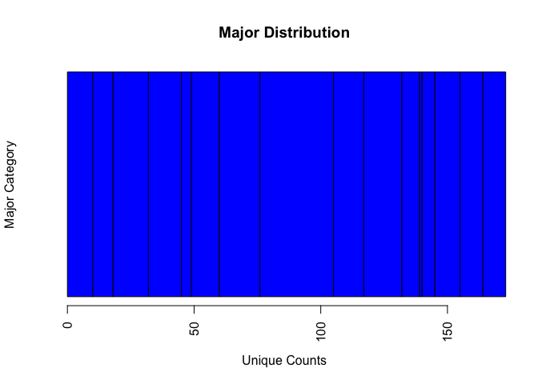

## Assignment 04
This assignment had 4 parts:

* Navigating the FiveThirtyEight Data
* Creating a Data Summary of the Data / Export to CSV
* Codebook creation on a Git Repository
* Swirl Lesson 15 on Graphs

###Question 1: FiveThirtyEight Data (30 points)
Navigate to [FiveThirtyEight](https://github.com/rudeboybert/fivethirtyeight) on GitHub and read README.md. Perform the commands listed below:

a. Install the fivethirtyeight package.


```r
library("fivethirtyeight")
fileURL <- "https://raw.githubusercontent.com/fivethirtyeight/data/master/college-majors/recent-grads.csv"
```

b. In the listing of Data sets in package ‘fivethirtyeight,’ assign the 22nd data set to an object ‘df.’


```r
library(repmis)
df <-repmis::source_data(fileURL)
```

```
## Downloading data from: https://raw.githubusercontent.com/fivethirtyeight/data/master/college-majors/recent-grads.csv
```

```
## SHA-1 hash of the downloaded data file is:
## 4b681ed0ae40cd8ee8f55da2b5e37943f0cd0a8f
```

c. Use a more detailed list of the data sets to write out the URL in a comment to the related news story.


```r
newsstory <- "https://fivethirtyeight.com/features/the-economic-guide-to-picking-a-college-major/"
```

d. Using R commands, give the dimensions and column names of this data frame.


```r
dim(df)
```

```
## [1] 173  21
```

```r
colnames(df)
```

```
##  [1] "Rank"                 "Major_code"           "Major"               
##  [4] "Total"                "Men"                  "Women"               
##  [7] "Major_category"       "ShareWomen"           "Sample_size"         
## [10] "Employed"             "Full_time"            "Part_time"           
## [13] "Full_time_year_round" "Unemployed"           "Unemployment_rate"   
## [16] "Median"               "P25th"                "P75th"               
## [19] "College_jobs"         "Non_college_jobs"     "Low_wage_jobs"
```

###Question 2: Data Summary (30 points)
Use your newly assigned data frame

a. Write an R command that gives you the column names of the data frame. Right after that, write one that counts the number of columns but not rows.


```r
colnames(df)
```

```
##  [1] "Rank"                 "Major_code"           "Major"               
##  [4] "Total"                "Men"                  "Women"               
##  [7] "Major_category"       "ShareWomen"           "Sample_size"         
## [10] "Employed"             "Full_time"            "Part_time"           
## [13] "Full_time_year_round" "Unemployed"           "Unemployment_rate"   
## [16] "Median"               "P25th"                "P75th"               
## [19] "College_jobs"         "Non_college_jobs"     "Low_wage_jobs"
```

```r
ncol(df)
```

```
## [1] 21
```

b. Generate a count of each unique major_category in the data frame. Assign it to major_count.


```r
library(plyr)
library(dplyr)
```

```
## 
## Attaching package: 'dplyr'
```

```
## The following objects are masked from 'package:plyr':
## 
##     arrange, count, desc, failwith, id, mutate, rename, summarise,
##     summarize
```

```
## The following objects are masked from 'package:stats':
## 
##     filter, lag
```

```
## The following objects are masked from 'package:base':
## 
##     intersect, setdiff, setequal, union
```

```r
major_count <- data.frame(df %>% group_by(df$Major_category) %>% tally())
major_count
```

```
##                      df.Major_category  n
## 1      Agriculture & Natural Resources 10
## 2                                 Arts  8
## 3               Biology & Life Science 14
## 4                             Business 13
## 5          Communications & Journalism  4
## 6              Computers & Mathematics 11
## 7                            Education 16
## 8                          Engineering 29
## 9                               Health 12
## 10           Humanities & Liberal Arts 15
## 11 Industrial Arts & Consumer Services  7
## 12                   Interdisciplinary  1
## 13                 Law & Public Policy  5
## 14                   Physical Sciences 10
## 15            Psychology & Social Work  9
## 16                      Social Science  9
```

c. To make things easier to read, enter par(las=2) before your plot to make the text perpendicular to the axis. Make a barplot of major_count. 


```r
par(las=2)
barplot(as.matrix(major_count$n, major_count$df.Major_category), 
        main="Major Distribution", 
        xlab = "Unique Counts", ylab = "Major Category", 
        horiz=TRUE, col = "blue")
```

<!-- -->

d. Write the fivethirtyeight data to a csv file. Make sure that it does not have row labels.


```r
write.csv(df, file = "df.csv", row.names=FALSE)
list.files()
```

```
## [1] "appleorange.csv"     "Assignment04_files"  "Assignment04.html"  
## [4] "Assignment04.md"     "Assignment04.Rmd"    "df.csv"             
## [7] "Scratch05.R"         "stability.csv"       "Unit05Project.Rproj"
```

###Question4: Codebook (30 points)
Simulate a codebook by completing the following:

a. Start a new repository on GitHub for your SMU MSDS homework. On your local device, make sure there is a directory for Homework at the minimum.

* GitHub Respository: https://github.com/lancedacy/6306

b. Create a README.md file which explains the purpose of the repository, the topics included, the sources for the material you post, and contact information in case of questions. Remember, the one in the root directory should be general. You are welcome to make short READMEs for each assignment individually in other folders.


c. In one (or more) of the nested directories, post your RMarkdown script, HTML file, and data from ‘fivethirtyeight.’ Make sure that in your README or elsewhere that you credit fivethirtyeight in some way.


d. In your RMarkdown script, please provide the link to this GitHub so the grader can see it.


